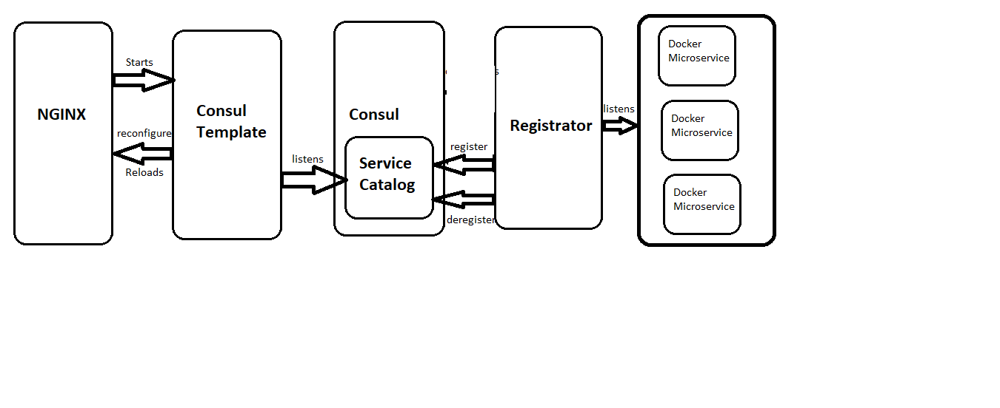

# SwiftOps Orchestration

### Introduction

The infrastructure consist of below components

* [Consul](http://www.consul.io) for service discovery
* [Registrator](https://github.com/gliderlabs/registrator) to register services with Consul. Registrator monitors for containers being started and stopped and updates Consul when a container changes state.
* [NGINX](http://nginx.org/)
* [Slack] (https://slack.com/)
* [Mongo DB] (https://www.mongodb.com/)
* All all services like perfservice,changeservice,rootservice,etc


NGINX used in conjuction with Consul, a Service discovery platform and Consul-Template, a generic template rendering tool that provides a convenient way to populate values from Consul into the file system using a daemon.


## Pre-Requisites

* [Docker for Mac](https://www.docker.com/products/docker#/mac) if running this locally on your MAC **OR** 
[docker-compose](https://docs.docker.com/compose/install) if running this on a linux VM



### To Enable SSL
    Navigate to .\nginx and edit nginx.conf :
    
	Replace <certificate_path> with path where your certificate file is present.
	
	Replace <certifiacte_key_path> with path where your certificate key file is present
	
	You can edit index.html file and add content your content.
	
	NOTE : As a reference, example.com.key and example.com.crt files can be found at project root.


## SetUp

* NGINX will be listening on port 80 on the docker host.
     1. If Docker Toolbox is used then the IP address of the docker-machine (default here) can be fetched with below command

     ```
     $ docker-machine ip default
     <IP>
     ```
     1. If Docker for Mac is used then the IP address to be used is 172.17.0.1

     Export this IP into an environment variable HOST_IP by running `export HOST_IP=<IP>` (used by docker-compose.yml below)
	 else `export HOST_IP=$(docker-machine ip default)`

* Now to spin up all the containers run: 

```
$ docker-compose up -d
```
There should be bunch of containers up and running:

OR USE
 
* To remove orphan containers before spinning up new continers run :
```
docker-compose up -d --remove-orphans
```
* Edit start_containers.sh file and replace all required parameters in the placeholders provided and then run the sh file.
	*** It will remove all the containers already not running and would add key value pairs in Consul.
	It would restart all the containers that would be using the parameters inserted as key value pairs.

```
$ docker ps           
CONTAINER ID        IMAGE                           COMMAND                  CREATED             STATUS              PORTS                                                                            NAMES
5f8a21f24094        swiftops/rootservice            "python root.py"         2 days ago          Up 2 days           0.0.0.0:32809->8082/tcp                                                          microservice_rootservice_1
469b0cf9fb24        microservice_nginx              "/usr/bin/runsvdir /…"   2 days ago          Up 2 days           0.0.0.0:80->80/tcp, 443/tcp                                                      nginx
ebe4631332d5        gliderlabs/registrator:latest   "/bin/registrator -i…"   2 days ago          Up 2 days                                                                                            registrator
28b6f19a3dd5        swiftops/masterservice          "python service.py"      2 days ago          Up 2 days           0.0.0.0:32802->8090/tcp                                                          microservice_masterservice_1
2aa6ccff9353        swiftops/conversationalui       "python ./UIComp/Sea…"   2 days ago          Up 2 days           0.0.0.0:32801->8088/tcp                                                          microservice_conversationalui_1
36151a09f597        swiftops/registerservice        "python service.py"      2 days ago          Up 2 days           0.0.0.0:32799->8083/tcp                                                          microservice_registerservice_1
ed81b28a7899        swiftops/changeservice          "python change_log.py"   2 days ago          Up 2 days           0.0.0.0:32808->8084/tcp                                                          microservice_changeservice_1
b1caff21cfc5        progrium/consul                 "/bin/start -server …"   2 days ago          Up 2 days           53/tcp, 53/udp, 8300-8302/tcp, 8400/tcp, 8301-8302/udp, 0.0.0.0:8500->8500/tcp   consul
857a550cf353        mongo                           "docker-entrypoint.s…"   2 days ago          Up 2 days           0.0.0.0:27017->27017/tcp                                                         microservice_mongo_1
231defe3ceaf        swiftops/perfservice            "python performance.…"   2 days ago          Up 2 days           0.0.0.0:32803->8086/tcp                                                          microservice_perfservice_1

```

## Accessing Consul Admin Console and Scaling Microservices

NGINX is listening on port 80 on the Docker Host, and runs Consul Template. Consul Template listens to Consul for changes to the service catalog, rewrites Nginx config file and reloads Nginx on any changes. 

So now just go to `http://<DOCKER-HOST-IP>:<PORT>/ui` (Note: Docker for Mac runs on IP address 127.0.0.1), this displays Consul UI page showing the list of all registered services.

To scale the services up:

```
$ docker-compose scale <SERVICE-NAME>=3
ex : $ docker-compose scale perfservice=3
Creating and starting microservice_perfservice_2 ... done
Creating and starting microservice_perfservice_3 ... done
```

Scale it down:

```
$ docker-compose scale <SERVICE-NAME>=1
Stopping and removing microservice_perfservice_2 ... done
Stopping and removing microservice_perfservice_3 ... done
```

All the changes should be automatically reflected in the NGINX config file (/etc/nginx/conf.d/app.conf) inside NGINX container. 

Another feature we are using here is the HTTP health checks with Consul. Registrator allows to specify these health checks by using extra metadata in labels for the service. More details on this can be found [here](http://gliderlabs.com/registrator/latest/user/backends/#consul). 
With the following two labels (SERVICE_80_CHECK_HTTP: / and SERVICE_80_CHECK_INTERVAL: 10s) applied to our http service in the docker-compose.yml file, Consul sends a / request to all http containers every 5 seconds and expect a 200 OK response in return for a container to be considered healthy. If a 200 OK is not received, the container will be removed from Consul and in turn removed from upstream block within NGINX configuration as well.

## Stopped container gets removed from load balancing pool
```
ex: docker stop <container_name>
$ docker stop microservice_perfservice_1
microservice_perfservice_1
```
On the Consul UI page (http://DOCKER-HOST-IP:<PORT>/ui/#/dc1/services/http),the container gets removed. Also the NGINX config file (/etc/nginx/conf.d/app.conf) gets reflected with the changes and server gets removed from there as well.

## Add New Microservice 

Step 1 : Add new microservice definition in docker-compose.yml

```
Syntax
<SERVICE-NAME>:
  image: <DOCKER-IMAGE-NAME>
  container_name: <CONTAINER-NAME>
  labels:
    SERVICE_80_NAME: <SERVICE-NAME>
    SERVICE_80_CHECK_HTTP: /
    SERVICE_80_CHECK_INTERVAL: 10s
	SERVICE_TAGS: <TAG-NAME>
  ports:
  - "<PORT_NO>"

Sample definition
masterservice:
  image: swiftops/masterservice
  container_name: masterservice
  labels:
    SERVICE_80_NAME: masterservice
    SERVICE_80_CHECK_HTTP: /
    SERVICE_80_CHECK_INTERVAL: 10s
	SERVICE_TAGS: data-service
  ports:
  - "8090"
```

Step 2: Export docker ip like
```
export HOST_IP=<IP>
ex . export HOST_IP=192.168.99.100
```

Step 3 : Re-run below command

```
docker-compose up -d --remove-orphans
```
Step 4 : Check newly added service on ```http://<DOCKER-HOST-IP>:<PORT>/ui```

Microservice will be available on the below url

```
http://<DOCKER-HOST-IP>/<SERVICE-NAME>/
```

## Microservices URL's
Syntax
`http://<NGINX-URL>/<SERVICE-NAME>/<API-URL>`

ex : 
http://example.com/perfservice/searchbox


## Add Key/Value in Consul and use it in code
1. Access consul console url i.e.  `http://<NGINX-URL>:<PORT>/ui`
2. Include consul_util.py in the project`
3. Add below code where to fetch the value from Consul

```from consul_util import _get_config_value
value = _get_config_value('#KEY#')```


example : value =  _get_config_value('DB_IP')

here, #KEY# is the key entered in Consul Console
  