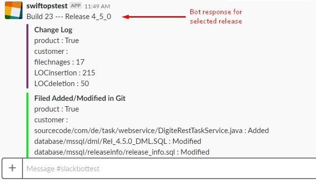

# SwiftOps Vision and Scope

## Introduction

SwiftOps is essentially a ChatOps product designed and developed by Digité DevOps team to
solve the need of communication between developers and DevOps Toolchain by providing a
unified conversation platform for various tools.

SwiftOps facilitates conversational interactions between the system and the user. For
Example: Using SwiftOps, you can get quick stats of the specific commit, tag, or branch,
along with work-items covered in that build (by connecting to ALM system) from the git
repository.

You can also execute CI / CD pipelines or request status of a particular job along with
histogram or graphs from logging tools if applicable.

# Overview
### What is ChatOps?
“ChatOps”  is all about conversation-driven operations. A bot is integrated with your chat and other key workplace applications bring functionalities, updates, and scripts into conversations that automate tasks and makes collaborations better and faster.

### What is Bot?
“Bot” is the core of ChatOps methodology. The Bot comes in the middle of the collaboration tool and the DevOps tools. The Bot receives requests from team members, then retrieves information from integrated systems by executing a set of commands (scripts).

# Audience
* This document useful for the users who are familiar with DevOps CI CD pipeline tools.
* This ChatOps is developed for PMs / Team Lead who are delivering projects in pre-planned release cycles. They need to get information related to their CI execution pipeline. Developers can get information about their commit checkin.
* ChatOps will also help developer/programmer who wants to build use cases on
ChatOps. It will help them to understand how to build ChatOps as centralised tool to capture data from various other tools.

# The Objective to build ChatOps
* ChatOps new API which gives developers the tools to create add-ons that supply your team with rich content and notifications, easily connect your applications and give you the ability to see what’s important so you can discuss, agree and take action directly in ChatOps.
* Ability to execute Jenkins pipelines using ChatOps.
* Integrate ELK dashboards with ChatOps.

# ChatOps Architecture Component

# ChatOps Architecture Component Tools

For more information about architecture component refer [Annexure](#annexure)
# Scope and Out Of Scope
##### Supported Use Cases
Below are the use cases covered in Release 1.0 of ChatOps
Build Status
This will give gist from,
1. Git using Git Changelog service for Nightly Build pipeline.
a. No. of files changed files.
b. LOC added.
c. LOC deleted.
2. Perf compares result using Perf Service for Nightly Build pipeline.
3. JUnit report result using JUnit Report Service for Nightly Build pipeline.
a. Total Units count
b. Errors count
c. Failures count
4. SCM metrics should get populated using SonarQube Integration.
a. Language-wise LOC
b. Other metrics captured in SonarQube.
5. Sahi report using Sahi Service for Nightly Build Pipeline.
a. Total scripts executed
b. Passed scripts
c. Failed scripts
d. Time took 
6. Trigger registered Jenkins job from Slack.
a. Register Jenkins job 
b. Trigger Jenkins job with build parameter. (maximum 5 parameter in Jenkins job)

##### Roadmap Use Cases
1. The user can register and execute Jenkins job from Slack itself.
2. Item list which is merged into patch branch but not in the current branch. (Missed Code Merges)
3. Populate ELK dashboards as output.
4. Include Rasa Core to implement ML in ChatOps.
5. Trigger Jenkins job using ChatOps.

# Getting Started

* ### Goal
    

    
    

    
    

    
    

    
    

    
    

* ### Try it now
    ### [Get started with ChatOps](https://github.com/swiftops/swiftops-orchestration)

# Annexure

### ChatOps Architecture Components

##### Messaging Platform
This platform can be any chat product which has the capability to interact with DevOps tools using a bot and bot APIs. Eg. Google Chat, Slack etc. As of now, we have integrated with
Slack.

For developing internal ChatOps we have used Slack as a messaging platform. We have used Slack bot and its features like,
    1. Webhooks / Slash Commands : It will allow to interact with our application from within Slack.
    2. Interactive Components : Any interactions with actions, dialogs, message buttons, or message menus will be sent to a URL that we specify.
    3. Oauth Access Token : To authenticate the user. 
    4. Slack API : To POST messages on Slack channel.
##### Bot Engine
Bot engine is a common logic developed by DevOps engineer/programmer. It will act as a
middleware between actual Microservices and a Messaging Platform.
This service filters the output given by the microservice layer, refine/parse the data and gives
the formatted data to the Messaging Platform in the required manner. It will defer from various Messaging Platform.
Below are the list of services developed as plugin in Bot Engine,
###### 1. Sahi Filter
Sahi automation report filter microservice calls the microservice which define in Sahi automation result parser microservice. The returned data is saved in MongoDB. Later it is used to display the Sahi failed summary in Slack.
###### 2. Jmeter Filter
This microservice is used to filter performance response and request and reads the data from performance microservice. There is already baseline result data kept on which we compare the latest JMeter result.
###### 3. Git Filter
This microservice is used to filter change log response and request and reads the data from the Git change log microservice. This service takes Release and Build number as input in the following format:
Release <RELEASE_NO>;<BUILD_NO>

The changelog is displayed of the given build and its previous build.
Note: If the release and build details are not provided, then the changelog of the
latest and the previous build will be displayed.
##### Caching Layer (Planned for future)
Caching layer is used for cached queries to generate a quick response.
##### Custom microservices
This feature allows users to write custom services to integrate tools with ChatOps.
Below are the out of box microservices provided along with ChatOps
    1. Sahi result parser
    2. JMeter result parser
    3. Git analytics engine
    4. JUnit result parser
##### Discovery Layer
This is Service discovery platform and generic template rendering tools layer. It provides a
convenient way to populate values into the file system using a daemon.
Tools used to build discovery layer for ChatOps are as follows
    1. [Nginx](https://www.nginx.com/resources/glossary/nginx/)
    2. [Consul](https://www.consul.io/intro/index.html)
    3. [Consul Template](https://www.hashicorp.com/blog/introducing-consul-template.html)
    4. [Registrator](http://gliderlabs.github.io/registrator/latest/)
